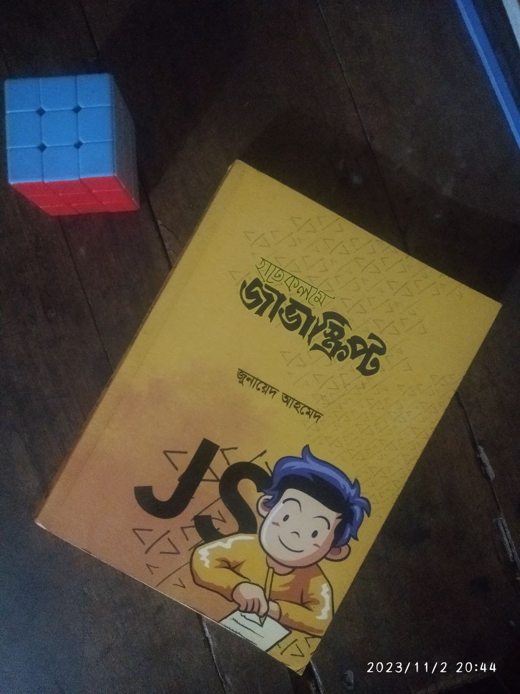

Revise JavaScript From Book
===========================

I revise the JavaScript from "হাতেকলমে জাভাস্ক্রিপ্ট" book. Writter is "জুনায়েদ আহমেদ"। This book has 6 chapter. There it is : 

- [Basic](./chapter_01/readme.md)
- [Advance](./chapter_02/readme.md)
- [ES6](./chapter_03/readme.md)
- [Everyday JavaScript](./chapter_04/readme.md)
- [Dom Manipulation](./chapter_05/readme.md)
- [Project](./chapter_06/readme.md)

